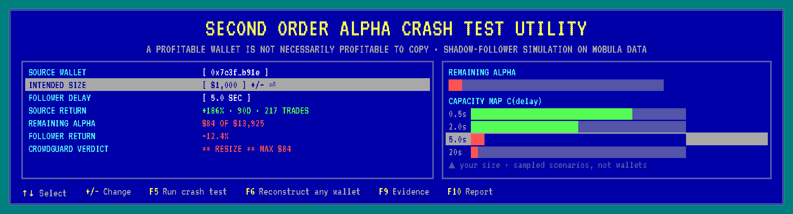
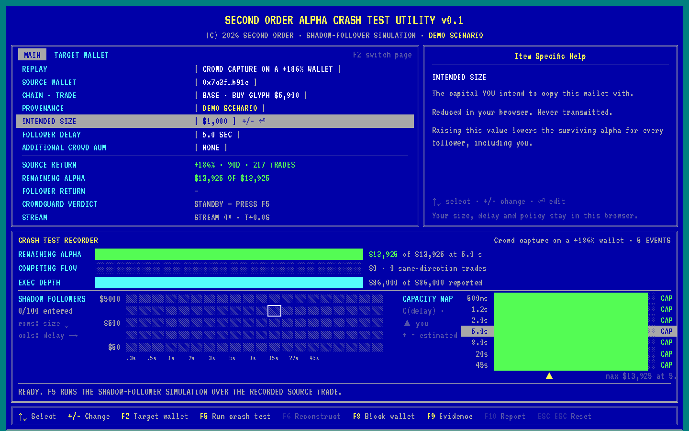
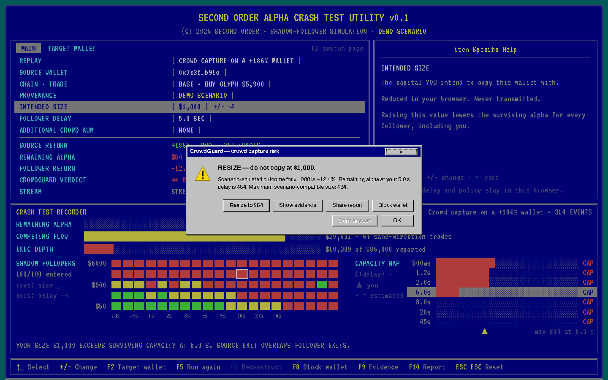
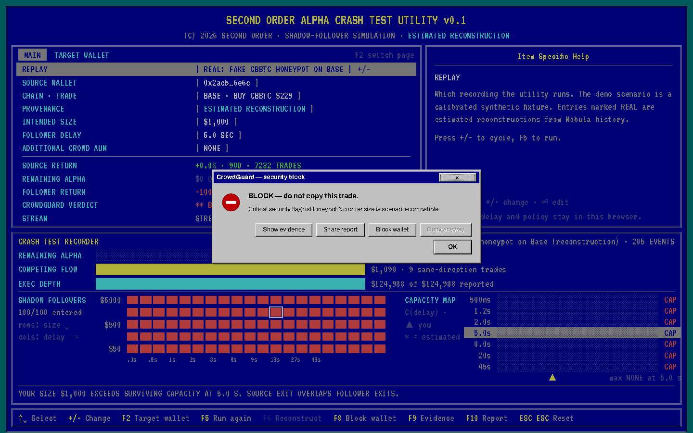
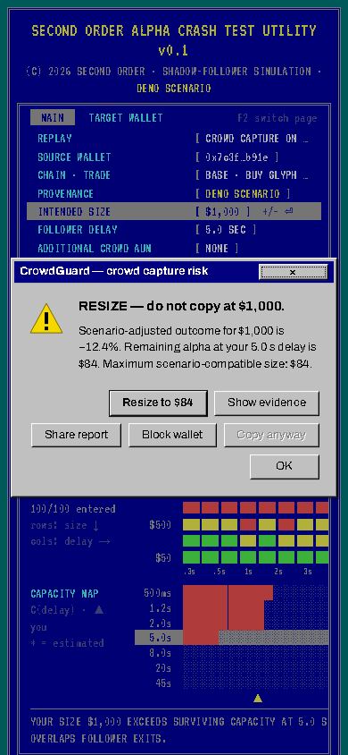

# SECOND ORDER


Second Order is an onchain **Alpha Crash Test**. *If I copy this wallet, what do I actually receive once delay, size, competing flow and the source's own exit are priced in?* It runs on Mobula's wallet, trade, market and security data and returns a private pre-trade verdict: **`ALLOW` · `RESIZE` · `BLOCK`**.

[Project Brief](PROJECT_BRIEF.md) | [Quickstart](docs/QUICKSTART.md) | [Demo Video](https://youtu.be/iZcqWZA_i_Y) | [Architecture](ARCHITECTURE.md) | [Docs](docs/learn/README.md) | [Submission](https://taikai.network/cryptocanal/hackathons/commons3nse/projects/cmtn9abkc009gpdpwh3rxuv1q/idea)

---

[Live Demo](https://second-order-crash-test.vercel.app) | [Stream API health](https://stream-production-900a.up.railway.app/health) | [Stream API reference](docs/learn/stream-api.md) | [Decisions](DECISIONS.md)

---

## Problem First

Copy-trading products rank wallets by *their* realized return. A wallet that made +186% is shown as something to follow. But the follower is not the source: they arrive seconds later, they pay the price impact of everyone who arrived before them, they exit after the source has already sold into the same pool, and if a hundred other followers had the same idea, the trade's edge is gone long before the last of them fills.

A profitable source wallet is not necessarily profitable to copy.



Second Order replays the source trade, runs a **shadow-follower simulation** across delays and sizes against observed quotes and **competing flow**, drains a **Remaining Alpha** meter as capacity is consumed, and evaluates your intended size and delay against what survives.

**The utility tells you:**
- the source's realized return, as a leaderboard would
- how much scenario-compatible follower capital remains at your delay, and how fast it drained
- your own scenario-adjusted outcome at your size
- the maximum scenario-compatible size, if any
- whether the source exited while followers were still holding
- what every number rests on, and how confident the model is

---

## Overview

Second Order is a two-part system:
- A **stream service** that turns [Mobula](https://mobula.io) observations into normalized, versioned events
- A **browser utility** that reduces those events into a capacity surface and a verdict, **locally**!

### The central object

> **Alpha Capacity Surface**  `C(delay, crowd AUM)` = the maximum aggregate follower capital for which the trade's scenario-adjusted follower expected value remains positive.

Remaining Alpha is `C` at your delay given the flow already observed. The CrowdGuard verdict compares your intended size against it.

### Core Principles

1. **Price the follower, not the leader.** Every number on the primary surface describes what a follower would receive.
2. **Evidence before verdict.** F9 opens the Evidence Log: provenance, model inputs, data quality, the latest quote column, the security snapshot, the competing-flow ledger and the assumptions.
3. **Fail conservative.** Missing or stale market, quote or security data can only move a verdict toward `RESIZE` or `BLOCK`.
4. **Name the provenance.** `DEMO SCENARIO`, `ESTIMATED RECONSTRUCTION` and `LIVE WITNESSED` are visibly different states everywhere a number appears.
5. **Private by default.** Size, delay and policy stay in `localStorage`.

---

## How It Works

At a high level, Second Order estimates this statement:

> *A follower of size `S` entering `D` seconds behind this trade, behind the flow that actually arrived before them, exiting after the source's remaining position is sold, would receive this scenario-adjusted outcome.*

### Observations (stream service)

**From Mobula:**
1. the source wallet's trades (`/api/2/wallet/trades`) → the anchoring buy and later exits
2. the wallet's trading analysis (`/api/2/wallet/analysis`) → the leaderboard number
3. the pool's trade history (`/api/2/token/trades`) → competing same-direction flow
4. 5-second candles (`/api/2/market/ohlcv-history`) → the price path after the trade
5. market details and token security (`/api/2/market/details`, `/api/2/token/security`) → depth, taxes, honeypot flags
6. with a Growth-plan key: the quoting and fast-trade WebSocket streams → live witnessed quotes and flow

> *Every observation becomes a `DomainEvent` with an explicit provenance kind. Duplicate id's are dropped. Every frame is validated at the boundary.*

### Model (browser, pure functions)

1. **Quote grid.** Observed quotes over (delay, size) become a continuous entry-price function: linear in delay, log in size, constant-product extrapolation marked as such beyond the observed envelope.
2. **Entry.** The follower pays the average price over their slice of the impact curve at their delay.
3. **Exit.** The target is the source's typical gain until a source exit is witnessed, then the current observed spot: no further upside is assumed once the source has left. The source's unsold remainder is sold first; exit depth is the lower of reported liquidity and the depth the latest quotes imply.
4. **Costs.** Buy/sell taxes from the security snapshot, a proportional platform fee and fixed gas per side.
5. **Capacity.** EV rises then falls in size; a golden-section search finds the peak and a bisection finds the upper root. That root is `C`.
6. **CrowdGuard.** `ALLOW` if your size is at or below `C` and every input is fresh and complete. `RESIZE` if a smaller size survives. `BLOCK` otherwise, or on a critical security flag.

> *The 100 shadow followers are 100 sampled (delay, size) scenarios re-evaluated as flow arrives.*

---

## Try it: The Fifteen-Second Crash Test



Press **F5**. A wallet with +186% realized return has just bought. Shadow followers board along the delay axis, green at first. Competing flow enters, execution depth thins, the source exits 55% of its position, Remaining Alpha collapses from $13,925 to $84. The CrowdGuard dialog reads: **RESIZE do not copy at $1,000. Scenario-adjusted outcome −12.4%. Maximum scenario-compatible size $84.** → Copy anyway is greyed out.

That run is a calibrated synthetic fixture and says so. Then switch `REPLAY` to a real one:



- **Fake CBBTC honeypot on Base.** A real wallet bought a token named CBBTC in a $250k pool; Mobula's static analysis flags it as a honeypot with a 100% sell tax; the wallet itself sold 86% four minutes in. Verdict: **SECURITY BLOCK**.
- **FLOCK on Base.** 109 same-direction trades in five minutes, pool deep enough that a $1,000 copy stays **scenario-compatible**.

Or press **F2**, type any wallet, and press **F6**: the utility reconstructs the minutes after its latest buy from Mobula history, in about fifteen seconds.



### Second Order can power:

1. pre-trade checks in copy-trading UIs
2. wallet leaderboards that show follower capacity next to source return
3. position sizing for signal groups
4. a prospective **Crowdproof** credential, earned only when a wallet's signals survive witnessed follower conditions

---

## Provenance States

| Label | Means | How it is produced |
|---|---|---|
| **DEMO SCENARIO** | Synthetic fixture, nothing from a market | Seeded generator, calibrated to the brief's numbers, committed with a manifest and disclosure |
| **ESTIMATED RECONSTRUCTION** | Real Mobula history fetched after the fact; quotes inferred from the price path and current depth | Stream service, any wallet, keyless demo API or your key |
| **LIVE WITNESSED** | Captured from Mobula streams while it happened | Growth-plan key; quoting + fast-trade WebSockets |

---

## Tech Stack

| Component | Technology | Purpose |
| --- | --- | --- |
| Data | **Mobula REST + WebSocket** | Wallet trades, pool history, candles, security, quotes, flow |
| Contracts | **Zod** | Versioned event envelope, API payloads, raw Mobula validators |
| Model | **TypeScript (pure)** | Quote grid, capacity solver, reducer, CrowdGuard; unit and property tests |
| Stream | **Fastify + SSE** | Providers (replay, reconstruction, live), dedupe, fan-out, capture |
| Persistence | **PostgreSQL + Drizzle** | Events, capacity snapshots, replay manifests, errors; sessions rebuilt after restarts |
| Web | **Next.js 16 + React 19 + Tailwind 4** | The setup utility; VT323 + Archivo self-hosted |
| Dialogs | **Radix** (behaviour only) | Focus, Escape, aria for the Win95 windows |
| Tests | **Vitest + Playwright** | 55 unit/integration tests, 15 e2e at 1440×900, 1280×800, 390×844 |
| Hosting | **Vercel + Railway** | Web on Vercel; stream + Postgres on Railway |

---

## Deployments

1. **Utility:** [https://second-order-crash-test.vercel.app](https://second-order-crash-test.vercel.app)
2. **Stream API:** [https://stream-production-900a.up.railway.app](https://stream-production-900a.up.railway.app) (`/health`, `/api/replays`, `/api/capabilities`, `/api/sessions`)
3. **Repository:** [https://github.com/MihRazvan/second-order](https://github.com/MihRazvan/second-order)

### Run locally

```bash
corepack enable && pnpm install
pnpm dev            # web :3000 · stream :4010 (keyless Mobula demo API unless MOBULA_API_KEY is set)
pnpm test           # unit + integration
pnpm test:e2e       # Playwright, needs pnpm dev
```

More in the [Quickstart](docs/QUICKSTART.md).

---

Built with <3 during the Crypto Canal's Common Sense hackathon, 2026 in Amsterdam.
